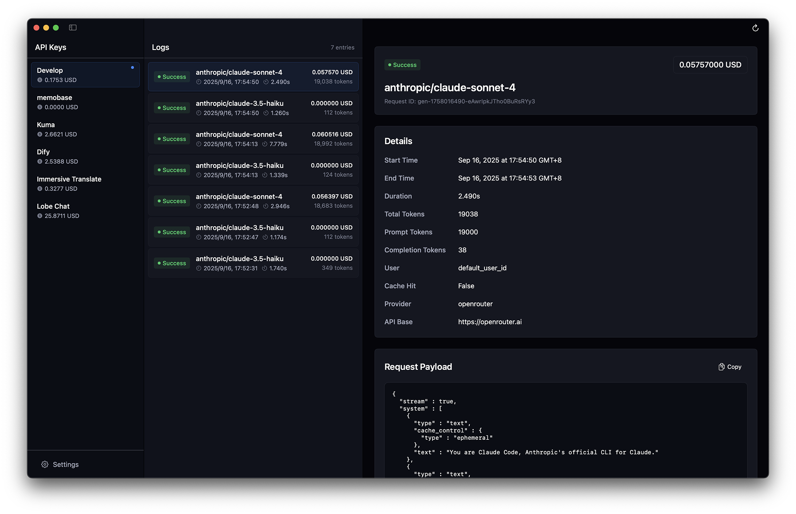

[English](README.md) | [中文](README_zh.md)

---

# LiteLog

**A beautifully designed, native macOS log viewer for LiteLLM.**

LiteLog offers a more efficient, integrated, and enjoyable log monitoring experience than a web UI or command line, allowing you to focus on API key management and log inspection with the fluency and beauty of a native application.



---

### ✨ Design Philosophy

Inspired by [Linear](https://linear.app), LiteLog is dedicated to bringing a modern, clean, and efficient design language to developer tools. We believe that great tools should not only be powerful but also a pleasure to use.

- **Modern UI**: A Linear-style dark theme provides an immersive visual experience.
- **Borderless Design**: A transparent title bar allows content to extend to the entire window, breaking free from traditional constraints.
- **Rich Interactions**: Carefully designed hover, selection, and click effects make every action clear and responsive.
- **Design System**: A unified system of colors, corner radii, and component specifications ensures visual and interactive consistency throughout the app.

### Core Features

- **Native macOS Experience**: Built with SwiftUI to leverage system features, ensuring low resource consumption and excellent performance.
- **API Key Management**: Automatically fetches and displays all virtual API keys from your LiteLLM instance, with support for showing aliases or key names.
- **Log Inspection**:
    - Clearly displays the log list for each key, including status, model, duration, cost, and other critical information.
    - **Enhanced Payload Views**: Click a log entry to view full request and response payloads with new "Formatted" and "JSON" views.
        - **"JSON" View**: Presents pretty-printed JSON with a one-click copy feature.
        - **"Formatted" View (Phase 1)**: Displays chat messages extracted from payloads in a chat-bubble-like format, grouped by role (System, User, Assistant), each with a copy-to-clipboard button. **Now also handles and displays tool calls within Assistant messages, even if the content is empty.**
    - **Intuitive View Switching**: Easily switch between "Formatted" and "JSON" payload views using a custom Linear-style picker.
- **State Persistence**:
    - Automatically saves the LiteLLM Base URL and Admin API Key.
    - Remembers the last selected API key and automatically loads it on launch.
    - Remembers the main window size, eliminating the need for repeated adjustments.
- **Smart Caching**: Caches loaded logs when switching between API keys to avoid unnecessary network requests and improve browsing speed.
- **Simple Configuration**: Easily configure connection parameters in a separate settings window. The main interface refreshes automatically after saving, no restart required.
- **Configurable Time Range & Pagination**: Set Lookback (hours) and Page Size. Bottom floating "Load Older" incrementally loads older logs (highlighted at bottom; not highlighted if content < one screen). Top floating "Back to Latest" scrolls to the latest without refreshing.

### 🚀 Power-user Experience
- **Keyboard Navigation**: Navigate the log list using arrow keys (`↑`/`↓`) and select an entry with `Enter`.
- **Global Hotkey**: Toggle the app window's visibility from anywhere in macOS with a global hotkey (`Cmd+Shift+L`).

### 🛠️ Tech Stack

- **Language**: Swift
- **Framework**: SwiftUI
- **Target Platform**: macOS 14 (Sonoma) or later
- **Project Management**: Xcode
- **Dependencies**: None. Kept lightweight and pure.

### 🚀 Getting Started

#### 1. Requirements
- macOS 14 (Sonoma) or later
- Xcode 15 or later

#### 2. Build and Run
1. Clone this repository to your local machine:
   ```bash
   git clone https://github.com/huangyafei/litelog.git
   ```
2. Open the project file `LiteLog.xcodeproj` with Xcode.
3. Select the `LiteLog` scheme and your Mac as the target device.
4. Click the "Build and Run" button (or use the shortcut `⌘ + R`).

#### 3. Configuration
1. After the app launches, open the settings window via the menu bar `LiteLog -> Settings...` (or shortcut `⌘ + ,`).
2. Enter the **Base URL** of your LiteLLM instance (e.g., `http://localhost:4000`).
3. Enter your LiteLLM **Admin API Key**.
4. Optionally adjust log options: **Lookback (hours)** and **Page Size** used for each fetch and when loading older logs.
5. Click "Save". The app will automatically refresh the data with the new configuration.

### 🤝 Contributing

Contributions of any kind are welcome! If you have ideas, suggestions, or find a bug, please feel free to open an [Issue](https://github.com/huangyafei/litelog/issues) or a [Pull Request](https://github.com/huangyafei/litelog/pulls).

### 📄 License

This project is licensed under the [MIT License](LICENSE).
